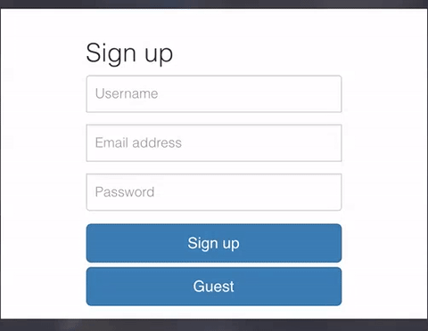
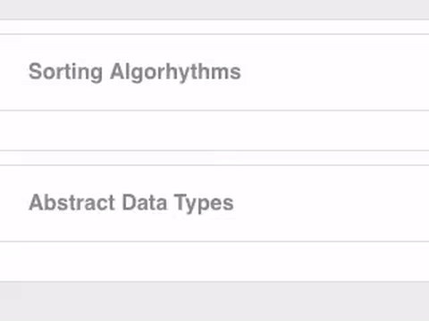

# TrollEverywhere

[TrollEverywhere][heroku] is a polling app that allows public speakers to engage their audience for instant feedback.

[heroku]: www.trolleverywhere.com/

## The Stack

The app is being served from **Heroku**. Data is stored in a **Postgres** DB, with large assets being hosted on Cloudinary.

A **Rails API** exposes several endpoints, supporting the front end.

Dependencies are managed with Bundler, npm and Webpack.

The front end is built with **ReactJS**, loosely following Facebook's **Flux** pattern.

## Front End Authentication

A session store maintains information about the current user. Logging in and out is facilitated by AJAX requests to the Rails `Api::SessionsController` which authenticates the user, responds with their information (for the session store) and sets a cookie.

All stores are set to respond to a dispatched 'logout' action by dumping their contents, to prevent a subsequent user of the same browser from accessing the previous user's data.

## Soft Signup

It's important to track participants in each poll, but we don't want to require users to sign up before being able to participate. To handle this, a soft signup was implemented that allows users to use the website for up to two weeks as an anonymous guest.

If they sign up for an account during that time, all of their information is transferred over to their full user account.

## Front End Form Validation

To give users instant feedback on their form submissions, as many problems as possible are caught on the front end:



## A Nested Schema

The schema has nested one-to-many relationships:

`Users -> Polls -> Questions -> Responses -> Votes`  
`Users -> Cast Votes`

This proved to be an interesting challenge and afforded me the chance to get my hands dirty with Rails' `accepts_nested_attributes_for`.

## Ordered Sublists

Allowing users to maintain a mutable order to their entries in the polls table turned out to be quite an interesting challenge.

A custom migration added an order column to hold indices of each item in the sublist, as well as deferred joint uniqueness constraints, ensuring no duplicate indices existed within a single sublist.

`ActiveRecord::Callbacks` on `before_validation` and `after_destroy` gave the means to ensure the order column was maintained.

Here are some excerpts of the Response model, showing the SQL code that fixed the order after a response was removed from the middle of a question's response sublist:

```ruby
class Response < ActiveRecord::Base
  ...
  belongs_to :question,
    inverse_of: :responses
  ...
  after_destroy :mend_ord
  ...
  def mend_ord
    responses = question.responses
    self.ord ||= responses.count
    transaction do
      self.class.connection.execute(<<-SQL)
      SET CONSTRAINTS deferred_ord_and_question_id DEFERRED;
      UPDATE "responses" SET ord = ord - 1
      WHERE "responses"."id" IN (
        SELECT "responses"."id" FROM "responses"
        WHERE "responses"."question_id" = #{self.question_id} AND (ord > #{self.ord})
        ORDER BY "responses"."ord" ASC
      );
      SQL
    end
  end
end
```

By deferring the constraints, we're able to hit the database a single time, updating all the indices in one go.

## React Editable Item

With the data nested the way it is, most of our input fields were small phrases of text, so I implemented a simple reusable React component that wraps input fields, allowing it to toggle between display and editing modes:



The component takes as props the text to display, and a callback which is passed the new value of the text on an update.

```html
<EditableItem updateText={this.updateTitle} text={poll.title} />
```
